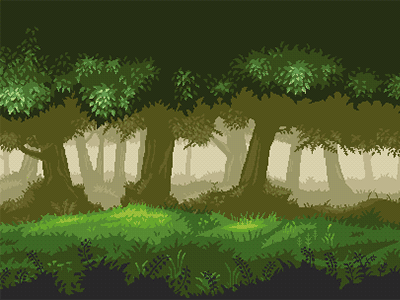
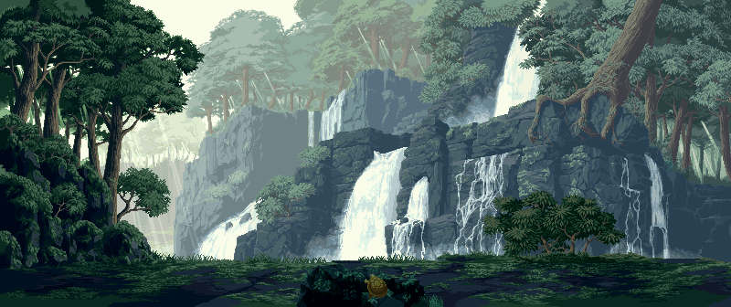

# 🌿🏹 Guerreiros da Floresta

### Um jogo web de estratégia, liderança e resistência.

 

  

  

---

# 🌳 Sobre o Jogo

**Guerreiros da Floresta** é um jogo web de estratégia ambientado em uma floresta exuberante, onde você assume o papel de líder de uma resistência indígena.

Utilize inteligência, planejamento e liderança para organizar expedições, proteger aldeias e conduzir seu povo através de desafios cada vez maiores.

---

# 📖 História

Após a chegada dos invasores, diversas aldeias indígenas tiveram suas terras tomadas e muitos habitantes foram capturados.

Diante dessa ameaça, os povos da floresta decidem se unir para lutar por sua liberdade e recuperar seus companheiros.

Sua jornada levará você por territórios desconhecidos, missões de resgate e grandes desafios estratégicos.

Cada decisão pode determinar o destino do seu povo.

---

# 🎯 Seu Objetivo

Como líder da resistência, você deverá:

- 🏹 Comandar guerreiros indígenas.
- 🌿 Defender aldeias e territórios.
- 🛶 Planejar expedições estratégicas.
- 🤝 Formar alianças.
- 📦 Gerenciar recursos.
- ⭐ Resgatar aliados capturados.
- 👑 Liderar seu povo rumo à liberdade.

---

# ⚔️ Recursos

### 🌿 Exploração
Descubra novas regiões da floresta e encontre recursos valiosos.

### 🏹 Estratégia
Planeje cuidadosamente cada movimento e coordene seus guerreiros.

### 🤝 Alianças
Una diferentes aldeias para fortalecer sua resistência.

### 📜 Narrativa
Uma jornada inspirada em eventos históricos, reimaginada em um universo de aventura e estratégia.

### 🚀 Jogo Web
Jogue diretamente pelo navegador sem necessidade de instalação.

---

# 🚀 Como Jogar

1. Acesse o jogo através do navegador.
2. Organize sua aldeia.
3. Reúna recursos.
4. Treine guerreiros.
5. Complete missões.
6. Resgate os capturados.
7. Conduza seu povo à vitória.

---

# 📱 Acesso

Escaneie o QR Code localizado no topo deste README para acessar rapidamente o jogo.

---

# 🛠️ Tecnologias

- HTML5
- CSS3
- JavaScript

---

# 💚 Apoie o Projeto

Se você gostou do projeto, considere deixar uma ⭐ neste repositório.

Seu apoio ajuda o desenvolvimento de novas funcionalidades.

---

## 🌿 A floresta chama seus guerreiros 🏹

### https://otavioxf.github.io/jogohistoria/

